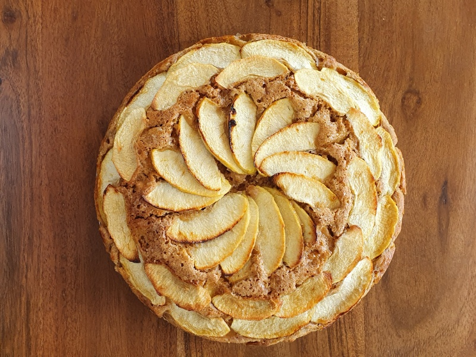

---
tags:
  - desert
---

# Apple Cake

| :material-clock-outline: Prep Time | :material-clock-outline: Cook Time | :fork_and_knife: Servings |
|------------------------------------|------------------------------------|---------------------------|
| 30 min                             | 1 h 15 min                         | 1 cake                    |

---

## Ingredients

- _375g_ flour (½ normal, ½ brown)
- 2 ½ teaspoons (tsp) of baking powder
- ½ tsp baking soda
- 2 tsp cinnamon
- ½ tsp salt
- _145g_ of vegan yogurt
- _180g_ cane sugar
- _240ml_ plant-based milk
- _80ml_ seed oil
- 1 tsp apple cider vinegar
- 1 tsp vanilla extract
- _600g_ (5 medium) apples
- 1 tablespoon of chia seeds
- ½ lemon

---

## Instructions

1. Preheat the oven to 180˚C.
2. Put the chia seeds into the yogurt and let them rest.
3. Peel and chop the apples into chunks and cover them with some lemon juice.
4. Into a large bowl combine flour, baking powder, baking soda, cinnamon and salt.
5. In another container mix sugar, milk, oil, vinegar, yogurt and vanilla flavor.
6. Pour the wet ingredients into the dry ones and stir them together (don’t overmix).
7. Add apples chunks and mix. Spoon into the pan and level.
8. Pour the batter into a round baking tray (diameter 26cm) lined with baking paper.
9. Bake the cake for around 1h to 1h15min at 180˚C.
10. Optionally sprinkle over some brown sugar (but add it about halfway through cooking, otherwise it could burn).
