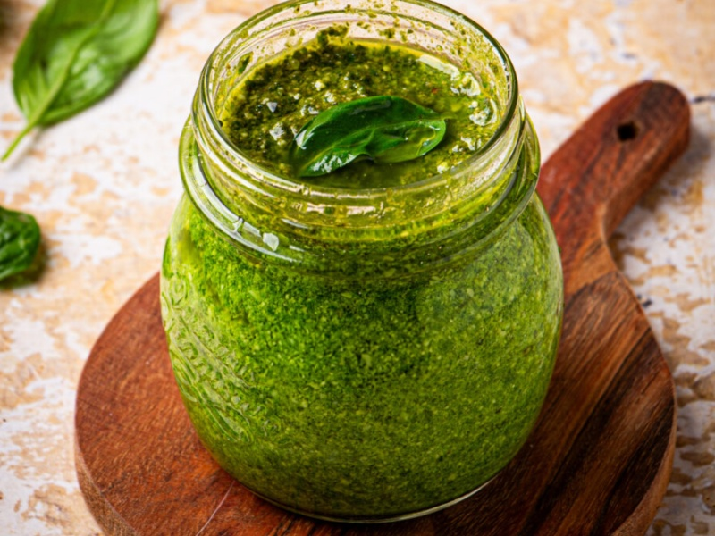

---
tags:
  - pasta
  - italian
---

# Basil Pesto

| :material-clock-outline: Time | :fork_and_knife: Servings |
|-------------------------------|---------------------------|
| 15 min                        | 4 portions                |

---

## Ingredients

- _35g_ basil
- _35g_ extra virgin olive oil
- _35g_ vegan topping (almonds, cashews and nutritional yeast)
- _15g_ pine nuts
- _1_ garlic clove or garlic powder by taste
- _1.5g_ big salt

---

## Instruction

1. Mix everything together in a mixer and add an ice cube.
2. For better results use a mortar and start breaking up the leaves, then add the pine nuts and finally the oil and remaining ingredients.
3. Use immediately or store in a jar with some olive oil.

### Genovese Variation

Add _100g_ of green beans and _100g_ of cubed potatoes. Cook everything in the same salty water:

- 14 minutes for frozen green beans
- 12 minutes for diced potatoes
- pasta according to instructions
