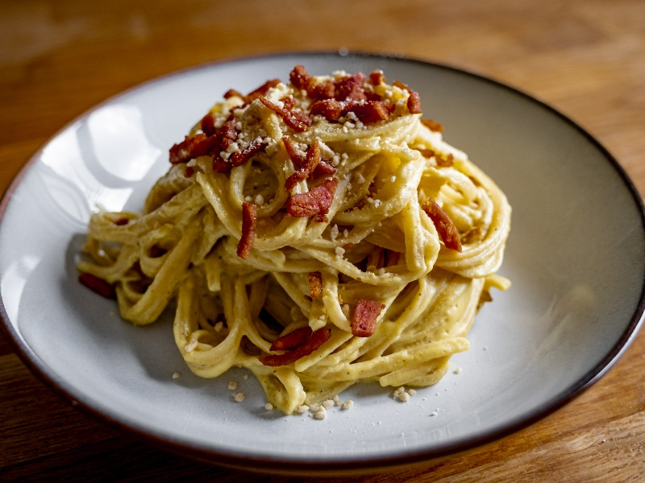

---
tags:
  - italian
  - pasta
---

# Carbonara

| :material-clock-outline: Time | :fork_and_knife: Servings |
|-------------------------------|---------------------------|
| 30 min                        | 4 portions                |

---

## Ingredients

- _400g_ smoked tofu / vegan bacon
- _80g_ chickpea flour
- _160ml_ water
- _80g_ cashews
- 2 or 3 tbsp nutritional yeast
- 1 tsp turmeric / saffron
- 3 tsp Kala Namak salt
- pepper

---

## Instruction

1. Soak the cashews in hot water for at least 10/15 minutes.
2. Cut the tofu in small cubes and brown it in a pan with a little bit of oil. Set aside.
3. Prepare a batter of water and chickpea flour and then scramble it in a frying pan over medium heat, stirring with a spoon until it has thickened.
4. Move this mixture into a blender and add cashews, nutritional yeast, turmeric, Kala Namak salt, pepper and a bit of warm water. Blend until smooth.
5. Once the pasta is cooked, add the sauce and the tofu cubes and mix well. Serve with a sprinkle of grated vegan cheese and pepper.

---

## Inspiration

- [Video Recipe Silvia Goggi](https://www.instagram.com/reel/Ch1PTrsouMH/?igshid=NjFhOGMzYTE3ZQ%3D%3D)
