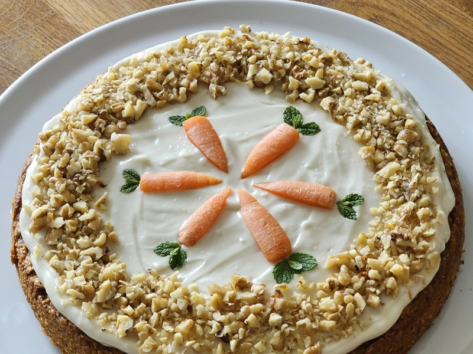
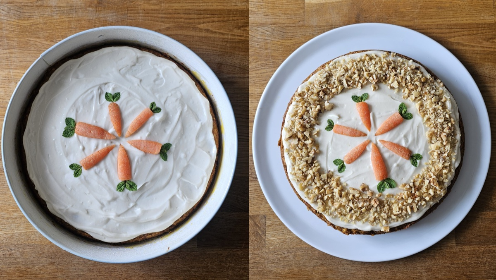

---
tags:
  - dessert
  - cake
---

# Carrot Cake

| :material-clock-outline: Prep Time | :material-clock-outline: Cook Time | :fork_and_knife: Servings |
|------------------------------------|------------------------------------|---------------------------|
| 30 min                             | 35-40 min                          | 1 cake (25 cm ∅)          |

---

## Ingredients

### Cake
- _375g_ carrots, finely grated
- _150g_ vegan butter, room temperature <!-- recommended 190g (150g butter + 40g neutral oil) for extra moisture -->
- _150g_ sugar (or maple syrup)
- 1 pinch salt
- ½ tsp ground vanilla (or 2-3 tsp vanilla extract)
- 3 flax eggs (_3 tbsp_ ground flaxseed + _9 tbsp_ hot water)
- _190g_ flour (all-purpose, spelt, or gluten-free)
- ¾ tsp cinnamon
- ½ sachet baking powder (Backpulver, ~8g) <!-- original used 2¼ tsp baking powder + ¾ tsp baking soda -->
- _150g_ ground almonds
- 1½ tsp apple cider vinegar

### Cream Cheese Frosting
- _150g_ vegan cream cheese
- _80g_ powdered sugar
- a squeeze of lemon juice
- 1 pinch ground vanilla (optional)

---

## Instructions

1. Make the flax eggs: mix _3 tbsp_ ground flaxseed with _9 tbsp_ hot water and set aside 5-10 min to thicken.
2. Preheat the oven to 180˚C (top and bottom heat). Grease a 25 cm round pan.
3. Peel and finely grate the carrots.
4. Beat the softened butter with sugar, salt and vanilla until creamy. Stir in the grated carrots and the flax eggs.
5. Sift in the flour, cinnamon and baking powder. Add the ground almonds and apple cider vinegar. Combine until just mixed.
6. Pour into the pan and bake on the middle rack for 35-40 min, until a skewer comes out clean.
7. Let the cake rest in the pan for 10 min, then remove it from the pan and let it cool completely.
8. For the frosting, mix the cream cheese, powdered sugar, lemon juice and vanilla with a hand mixer until creamy. Spread over the cooled cake.
9. Decorate with marzipan carrots and chopped pistachios. Store refrigerated for 3-4 days.

---

## Inspiration
- [Bianca Zapatka](https://biancazapatka.com/en/moist-and-simple-carrot-cake-vegan/)
