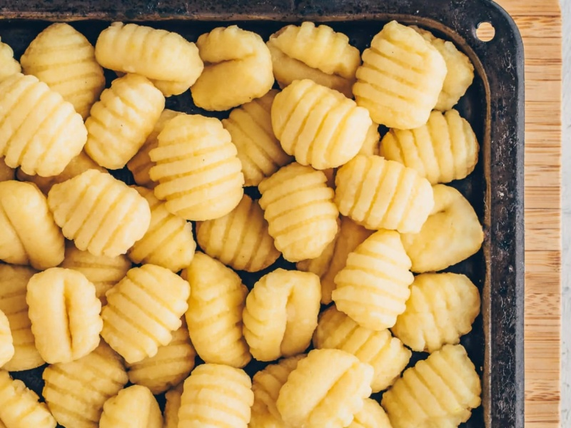

---
tags:
  - italian
---

# Chickpea Gnocchi

| :material-clock-outline: Time | :fork_and_knife: Servings |
|-------------------------------|---------------------------|
| 30 min                        | 2 portions                |

---

## Ingredients

- _480g_ chickpeas
- _4 tbsp_ olive oil
- salt and peper
- _100g_ flour
---

## Instruction

1. Put chickpeas, olive oil, salt and peper to food processor and blend until smooth.
2. Transfer the mixture to a bowl, and slowly add flour while kneading the dough.
3. Stop kneading when the dough is no longer sticky.
4. Divide the dough into 4 parts and roll each part into a long sausage.
5. Cut the sausage into 2 cm pieces.
6. Optional: Roll each piece over a fork to create the typical gnocchi shape.
7. Bring a large pot of salted water to a boil. Drop the gnocchi into the boiling water and cook until they float to the surface. This should take about 2-3 minutes.
8. Add your favorite sauce and enjoy!

---

## Inspiration

- [Gigi Grassia](https://www.instagram.com/p/C2UQMLQrsvt/)
