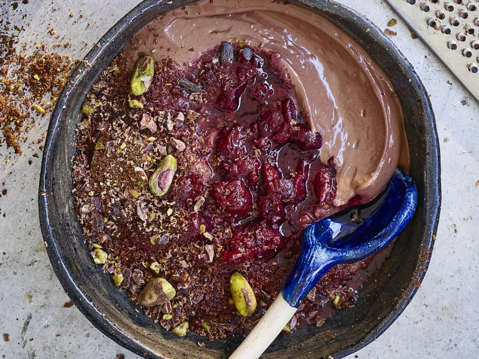

---
tags:
  - desert
  - tofu
---

# Chocolate Mouse

| :material-clock-outline: Time | :fork_and_knife: Servings |
|-------------------------------|---------------------------|
| 30 min                        | 4 portions                |

--- 

## Ingredients

### Mousse

- _400g_ Silken Tofu
- _60ml_ Soy Milk
- 1 tbs Vanilla Bean Paste
- _50ml_ Maple Syrup (or sweeten to taste)
- 1 tbs Spearmint Essence
- 2 tbs Cacao Powder
- _125g_ Dark Chocolate, melted

### Crumble Topping

- _40g_ Your Favourite Vegan Chocolate Biscuits/Cookies
- _40g_ Pistachio Nuts
- 3 tbs Cacao Powder
- Pinch of Sea Salt
- 4 tbs Cacao Nibs

--- 

## Instruction

1. For the mousse, add all the ingredients except the melted chocolate to your blender & blend until smooth. Turn the blender onto low speed then slowly trickle in the melted chocolate.
2. Once smooth & creamy, transfer the mousse to a bowl & place into the fridge for a few minutes to set.
3. Meanwhile, clean out your blender & add the crumble ingredients & blitz to a crumb.
4. Serve up the mousse topped with cherry compote or fresh berries of your choice, the chocolate crumble & a sprig of mint.

---

## Inspiration

- [Gaz Okley (Avant Garde)](https://www.gazoakleychef.com/recipes/mint-chocolate-mousse/)