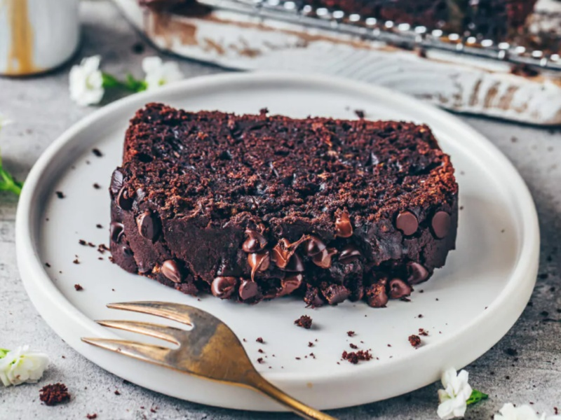

---
tags:
  - desert
---

# Chocolate Zucchini Bread

| :material-clock-outline: Prep Time | :material-clock-outline: Cook Time | :fork_and_knife: Servings |
|------------------------------------|------------------------------------|---------------------------|
| 1 h 20 min                         | 40 min                             | 1 cake (24 cm ∅)          |

---

## Ingredients

### Dry:

- _160g_ flour
- 1 tbsp of starch
- _50g_ cocoa powder
- _2 tsp_ baking powder
- _½ tsp_ salt
- _60ml_ non-dairy milk
- _100ml_ grapeseed or canola oil
- _150g_ cane sugar
- _1 tsp_ vanilla extract
- _1 tsp_ apple cider vinegar
- _¼ tsp_ espresso powder
- _1_ ripe mashed banana or ½ cup apple sauce or 2 flax-eggs
- _250g_ shredded zucchini
- _150g_ vegan chocolate chips or chopped chocolate

---

## Instructions

1. Sift the flour, cornstarch, cocoa, baking powder, and salt into a mixing bowl and whisk together.
2. To a separate jar add the milk, oil, sugar, vanilla extract, apple cider vinegar, coffee powder and mashed banana.
   Mix to combine.
3. Pour this mixture into the flour mixture and stir until just combined.
4. Add the shredded zucchini and chocolate chips.
5. Grease and line a loaf pan with parchment paper so that there is an overhang on both sides.
6. Fill the batter into your prepared pan. Optionally, top with more chocolate chips.
7. Preheat the oven to 350˚F (175˚C).
8. Bake for about 50-60 minutes (use the toothpick test).

---

## Inspiration
- [Bianca Zapata - Chocolate Zucchini Bread](https://biancazapatka.com/en/chocolate-zucchini-bread/#recipe)
