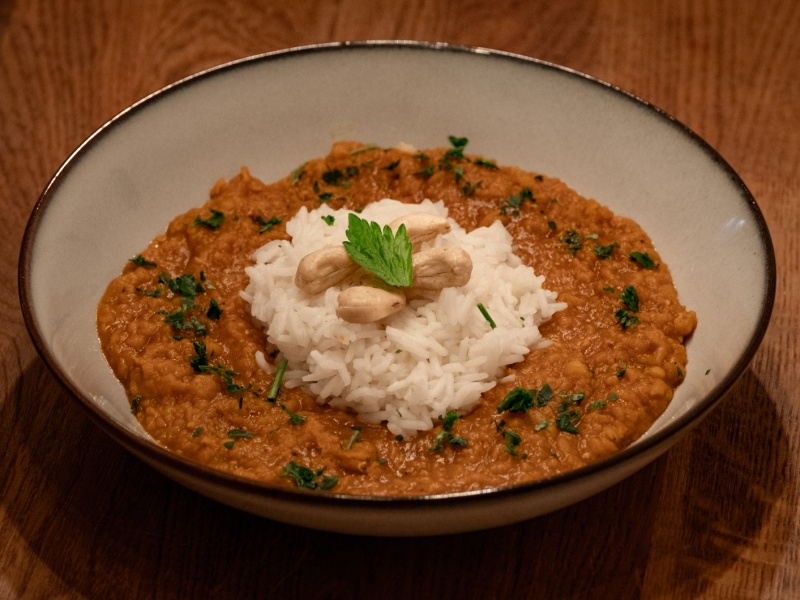

---
tags:
  - indian
  - rice
  - lentils
---

# Red Lentil Dal

| :material-clock-outline: Time | :fork_and_knife: Servings |
|-------------------------------|---------------------------|
| 40 min                        | 4 portions                |

--- 

## Ingredients

- _240g_ basmati rice
- _300g_ lentils
- 1 garlic clove
- 1 tbsp of grated ginger
- 1 tbsp turmeric
- 1 tbsp garam masala
- 1 tbsp curry

--- 

## Instruction

1. Cook the rice according to instructions...

---
