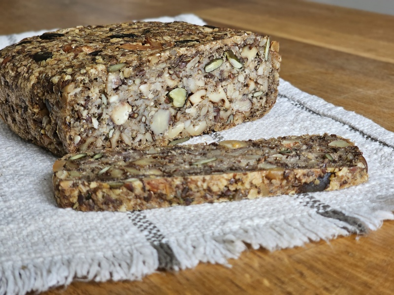

---
tags:
  - bread
  - snack
  - starter
---

# No-Knead Seed Bread

| :material-clock-outline: Prep Time | :material-timer-outline: Bake time | :fork_and_knife: Servings |
|------------------------------------|------------------------------------|---------------------------|
| 10 min                             | 75 min                             | 20 slices                 |

---

## Ingredients

- _30g_ chia seeds
- _53g_ psyllium husk
- _225g_ porridge oats (rolled or jumbo)
- _225g_ mixed nuts, chopped
- _225g_ mixed seeds
- 2¼ tsp fine sea salt
- _600ml_ water
- 4½ tbsp extra virgin olive oil

---

## Instruction

1. Gather and prepare your ingredients. Line a loaf tray with parchment paper, or lightly grease with olive oil. Preheat your oven to 190°C/170°C fan.
2. Place the chia seeds, psyllium husk, oats, nuts, seeds, and salt into a large bowl. Stir to combine.
3. Pour in the water and olive oil and mix well.
4. Scrape the mixture into your prepared tray. If you like, you can leave it to soak for 30 minutes - 8 hours at this stage.
5. Bake for 60 minutes. Remove from the tray and bake for a further 15 minutes. Remove from the oven and allow to cool completely before slicing.

---

## Inspiration

- [The Doctor's Kitchen](https://www.thedoctorskitchen.com/recipes/doctor-s-daily-bread)
