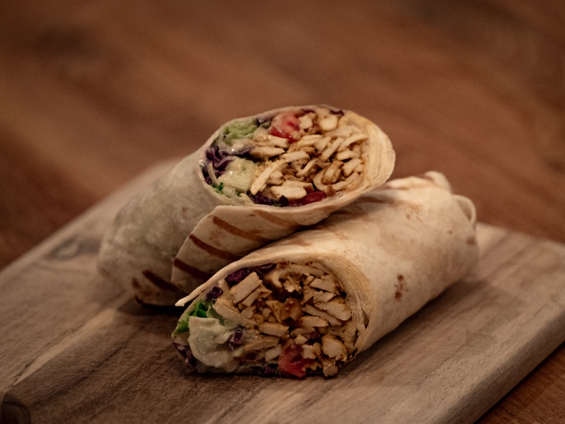

---
tags:
  - tofu
---

# Kebab

| :material-clock-outline: Time | :fork_and_knife: Servings |
|-------------------------------|---------------------------|
| 30 min                        | 4 portions                |

---

## Ingredients

- 2 blocks of extra firm tofu
- 6 wraps
- salad
- tomatoes
- cabaage
- cucumber

### Marinade

- 4 tbsp soy sauce
- 1 tbsp BBQ sauce
- 1 tsp mustard
- 3 drops of sriracha sauce (optional)
- 1 tsp smoked paprika
- 1/2 tsp garlic powder
- 1/2 tsp turmeric
- 1 tsp cumin
- 1 tbsp nutritional yeast
- salt and pepper

### Yogurt Sauce
- 4 tbsp soy yogurt
- 1/2 tbsp lemon juice
- 1 tsp tahini
- 1 tsp agave syrup
- salt and pepper
- 1/4 grated cucumber
- 1 tsp olive oil
- parsley

---

## Instruction

1. Grate the tofu and fry it in the pan.
2. Cut the vegetables into small pieces.
2. Mix all the ingredients for the marinade and add the tofu.
3. Mix all the ingredients for the yogurt sauce.
4. Prepare the wraps with the salad, tomatoes, cabbage, cucumber, tofu and yogurt sauce.
5. Toast the wraps on a grill.
6. Serve and enjoy!

---

## Inspiration

[Instagram](https://www.instagram.com/reel/CY9s1vBoCJ5/?utm_source=ig_web_copy_link&igsh=MzRlODBiNWFlZA==)
