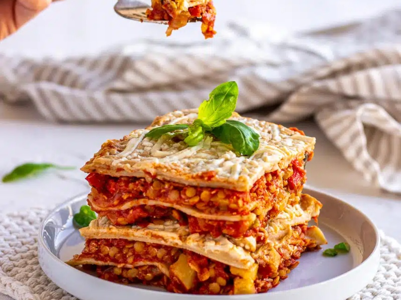

---
tags:
  - italian
  - pasta
---

# Lasagna

| :material-clock-outline: Prep Time | :material-clock-outline: Cook Time | :fork_and_knife: Servings |
|------------------------------------|------------------------------------|---------------------------|
| 15 min                             | 30 min                             | 4 servings                |

---

## Ingredients
- Big pot of [ragù](../ragu/index.md) sauce
- Zucchini
- Package of lasagna sheets
- Parmesan cheese (optional)
- Bread crumbs

---

## Instruction

1. Warmup the [ragù](../ragu/index.md) sauce.
2. Use vegetable peeler to cut long zucchini slices.
3. Assemble the lasagna:
    - Spread a layer of ragù sauce on the bottom of the baking dish.
    - Add a layer of lasagna sheets.
    - Add a layer of zucchini slices.
    - Add a layer of ragù sauce.
    - Optionally, sprinkle some Parmesan cheese.
    - Repeat until you reach the top of the tray.
4. The last layer should be ragù sauce. Sprinkle some bread crumbs on top.
5. Bake in the oven at 180˚C for 30 minutes (or according to the instructions on the package of lasagna sheets).

---

## Inspiration
- Simnett Nutrition [Video Recipe](https://www.youtube.com/watch?v=Njf5sT8f8eU&ab_channel=SimnettNutrition)
