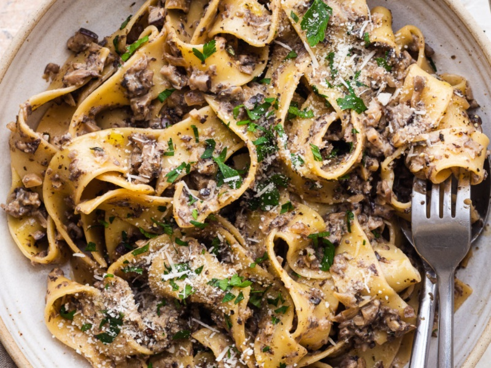

---
tags:
  - italian
  - pasta
---

# Creamy Mushroom Pasta

| :material-clock-outline: Time | :fork_and_knife: Servings |
|-------------------------------|---------------------------|
| 30 min                        | 2 portions                |

---

## Ingredients

- _50g_ white onion
- _250g_ mushrooms (e.g. champignon)
- _50g_ walnuts
- 4 or 5 dried mushrooms
- 1 tbsp of nutritional yeast
- EVO oil
- salt and pepper
- parsley

---

## Instruction

1. Soak the dried mushrooms in warm water for approximately 10 minutes.
2. Chop the onion and sauté it in a pan with a drizzle of EVO oil.
2. Dice the mushrooms and add them to the pan. Finely chop the walnuts and add them as well.
3. Add salt and pepper and cook for a few minutes until the mushrooms are tender and their water has evaporated.
4. Add part of the cooked mushrooms to a blender, along with the soaked dried mushrooms and a bit of their soaking water. Add nutritional yeast and blend until you achieve a creamy consistency.
5. Combine the blended mixture with the remaining mushrooms in the pan and adjust seasoning if necessary.
6. Finely add the cooked pasta, mix well and decorate with a sprinkle of parsley.

---

## Inspiration
[Mrs Veggy - Ragù bianco autunnale](https://www.instagram.com/reel/DAbRSBTILD3/)
