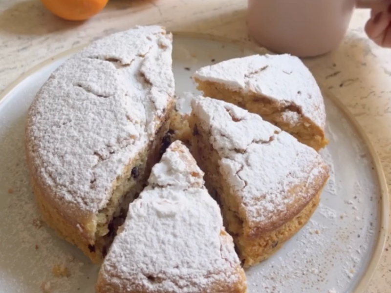

---
tags:
  - desert
---

# Orange Cake

| :material-clock-outline: Prep Time | :material-clock-outline: Cook Time | :fork_and_knife: Servings |
|------------------------------------|------------------------------------|---------------------------|
| 30 min                             | 45 min                             | 1 cake (26 cm ∅)          |

---

## Ingredients

- _300g_ flour
- _70g_ almond flour
- 1 baking powder
- ½ tsp salt
- zest of 2 oranges
- _150g_ cane sugar
- _80g_ seed oil
- _300g_ orange juice
- _120g_ dark chocolate
- powdered sugar

---

## Instructions

1. Preheat the oven to 180˚C.
2. Mix flour, almond flour, baking powder, salt and orange zest in a bowl.
3. In another bowl, mix sugar, oil and orange juice.
4. Combine both mixtures and stir until smooth.
5. Chop the chocolate and add it to the dough.
6. Pour the dough into a greased cake tin and bake for 45/50 min.
7. Let the cake cool down.
8. Sprinkle with powdered sugar.

## Inspiration
- [Cucina Botanica](https://www.instagram.com/reel/CoSKGCErEj-/?utm_source=ig_web_copy_link&igsh=MzRlODBiNWFlZA==)
