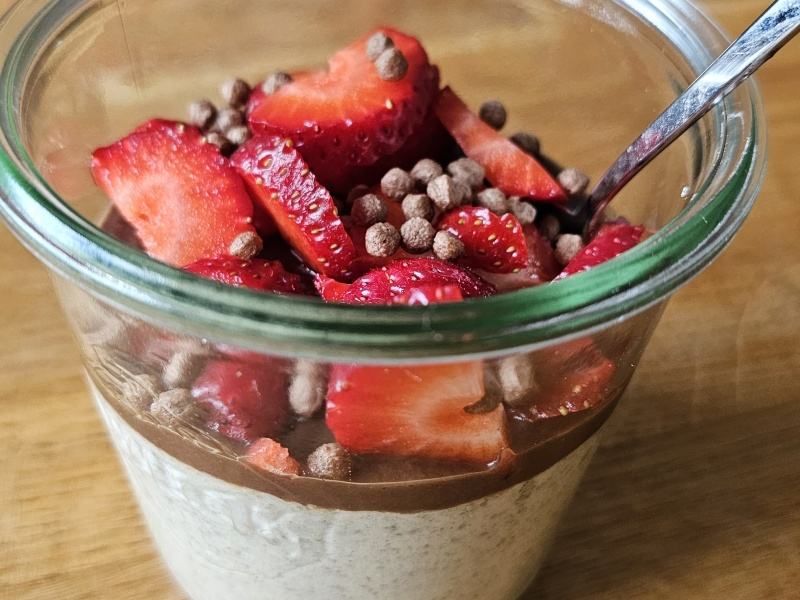

---
tags:
  - breakfast
---

# Overnight Oats

| :material-clock-outline: Time | :fork_and_knife: Servings |
|-------------------------------|---------------------------|
| 30 min                        | 6 portions                |

---

## Ingredients

###  Base

- _200g_ oats
- _1150mL_ water
- 4 scoops of protein powder
- _50g_ peanut butter

### Tiramisu version
- 1 cup of espresso coffee
- 1 tsp cacao powder

---

## Instruction

1. TODO

---

## Inspiration
