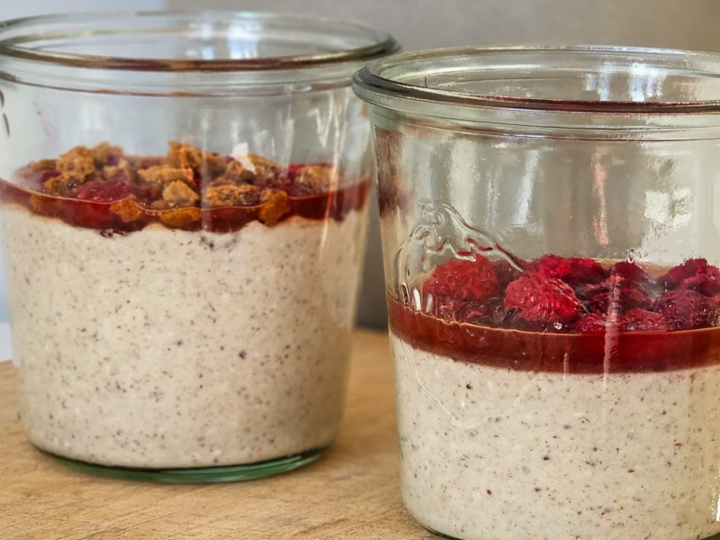
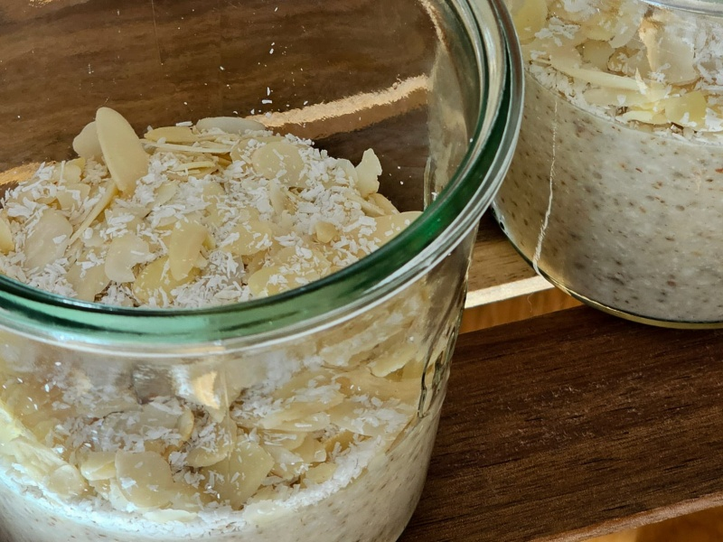
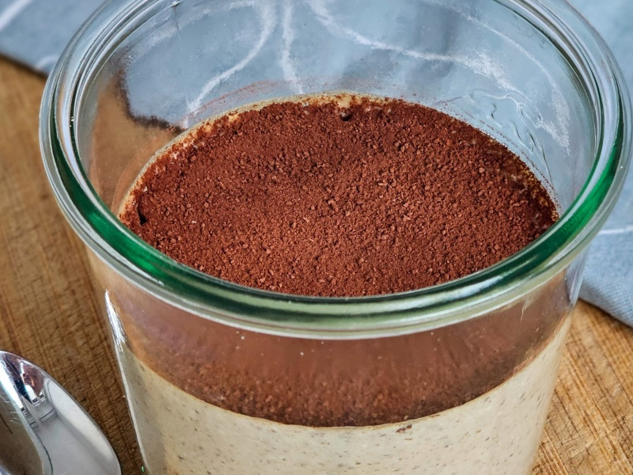
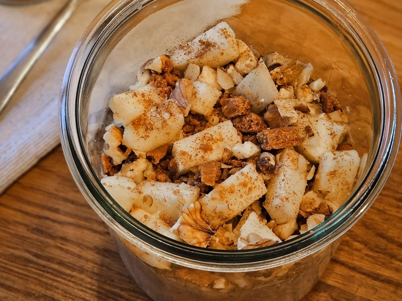
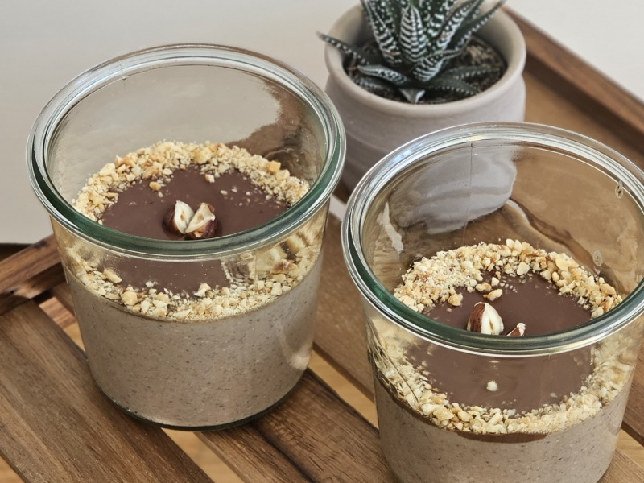

---
tags:
  - breakfast
---

# Overnight Oats

| :material-clock-outline: Time | :fork_and_knife: Servings |
|-------------------------------|---------------------------|
| 30 min                        | 6 portions                |

---

A collection of protein-packed overnight oats variations. Simply blend the ingredients, refrigerate, and wake up to a delicious ready-made breakfast.

---

## Cheesecake

### Ingredients

####  Base

- _1150mL_ water
- _6_ spoons of vanilla protein powder
- _5 tbsp_ ground chia/flax seeds
- _200g_ oats
- _50g_ peanut butter
- _2_ drops of vanilla extract

#### Topping

- 12 tbsp of strawberry/raspberry marmalade 
- fresh strawberries/raspberries
- crumbled cookies

### Instructions

1. Combine all the base ingredients in a blender and blend until smooth.
2. Pour the mixture into glass containers and refrigerate for at least 2 hours.
3. Before serving, prepare a marmalade mixture (two spoons marmalade one spoon water) and pour it on top.
4. Finish with a mix of fresh strawberries/raspberries and crumbled cookies.

## Raffaello

### Ingredients

#### Base

- _1200mL_ of water
- _6_ spoons of coconut protein powder
- _5 tbsp_ ground chia/flax seeds
- _100g_ of oats
- _50g_ of coconut flakes
- _50g_ of almond flour
- _50g_ almond butter
- 2~3 drops of almond extract (don't exagarate!)

#### Topping

- almond slices
- shredded coconut

### Instructions

1. Combine all the base ingredients except almond extract in a blender and blend until smooth.
2. You can replace some water with coconut milk for extra flavor.
3. Add a drop of almond extract. Mix and taste. Repeat until you are satisfied with the flavor.
4. Pour the mixture into glass containers and refrigerate for at least 2 hours.
5. Serve with a mix of almond slices and shredded coconut on top.

---

## Tiramisu

### Ingredients

#### Base

- _1200mL_ of water
- _6_ spoons of vanilla protein powder
- _5 tbsp_ ground chia/flax seeds
- _200g_ of oats
- _50g_ peanut butter
- _2_ cups of espresso coffee
- cookies of your choice

#### Topping

- cookies
- vanilla yogurt
- cacao powder

### Instructions

1. Combine all the base ingredients except cookies in a blender and blend until smooth.
2. Pour the mixture into glass containers.
3. Submerge one or two cookies into each glass container. 
4. Refrigerate for at least 2 hours.
5. Before serving, add two spoons of vanilla yogurt on top and sprinkle it with cacao powder.

## Apfelstrudel

### Ingredients

#### Base

- _950mL_ of water
- _6_ spoons of vanilla protein powder
- _5 tbsp_ ground chia/flax seeds
- _180g_ of oats
- _50g_ almond butter
- _1_ apple
- _7 tsp_ cinnamon
- _50g_ of walnuts
- _4 tsp_ of cane sugar

#### Topping

- diced fresh apple
- raisins
- crushed walnuts
- cinnamon

### Instructions

1. Combine all the base ingredients in a blender and blend until smooth.
2. Pour the mixture into glass containers and refrigerate for at least 2 hours.
3. Before serving, top with diced fresh apple, raisins, crushed walnuts, and a sprinkle of cinnamon.

## Ferrero Rocher

### Ingredients

#### Base

- _1200mL_ of water
- _6_ spoons of chocolate protein powder
- _5 tbsp_ ground chia/flax seeds
- _150g_ of oats
- _50g_ hazelnut flour
- _2 tbsp_ cocoa powder
- _50g_ peanut butter

#### Topping

- _80g_ dark chocolate (chopped)
- _100mL_ plant-based milk
- chopped roasted hazelnuts

### Instructions

1. Combine all the base ingredients in a blender and blend until smooth.
2. Pour the mixture into glass containers and refrigerate for at least 2 hours.
3. Make the ganache by placing the chopped chocolate and milk into a bowl and put it into the microwave for 2 min with 200 W. Stir it every 30 seconds.
4. Pour the ganache on top and sprinkle with chopped roasted hazelnuts.

[TODO]: <> (Add "Lemon Tart" version)
