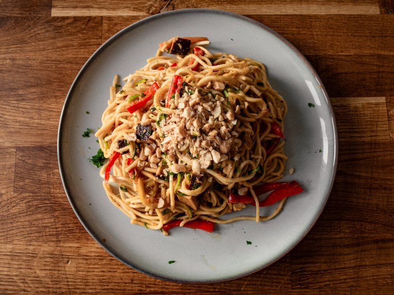

---
tags:
  - asian
  - peanuts
  - tofu
---

# Pad Thai

| :material-clock-outline: Time | :fork_and_knife: Servings |
|-------------------------------|---------------------------|
| 45 min                        | 4 portions                |

## Ingredients

- 1 Block of Smoked Tofu
- 1 Zucchini
- 1 Red Bell Pepper
- 1 Carrot
- ½ Broccoli
- _100g_ edamame
- _350g_ noodles
- _50g_ peanuts

### Sauce

- 5 tbsp soy sauce
- 2 tbsp grated ginger
- 1 tbsp peanut butter
- 1 tbsp sesame oil
- 1 tsp lemon grass
- 1 tsp sweetener of choice (maple or agave syrup)
- 1 tsp garlic powder

--- 

## Instruction

1. Fry the tofu in a pan with a little bit of oil until it gets brown. Set aside.
2. Chop the vegetables and stir-fry them in a pan with a little bit of oil. Set aside.
3. Cook the noodles according to the instructions on the package.
4. Mix all the ingredients for the sauce in a bowl.
5. Drain the noodles and add put them in a large pan.
6. Pour the sauce into the noodles and mix well.
7. Add the vegetables and tofu and mix again.
8. Serve with peanuts.
