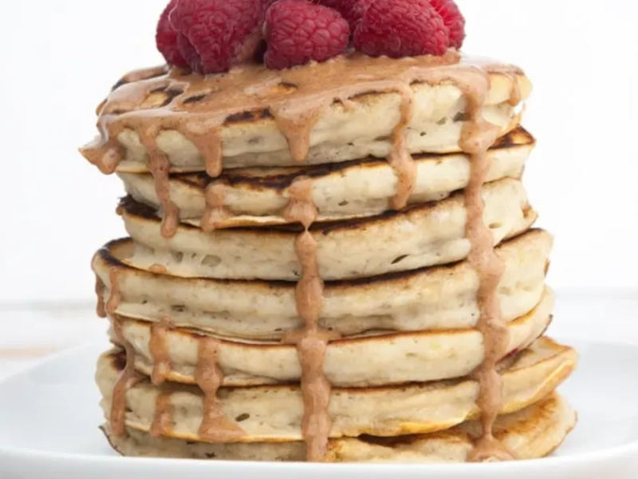

---
tags:
  - breakfast
---

# Pancakes

| :material-clock-outline: Prep Time | :material-clock-outline: Cook Time | :fork_and_knife: Servings |
|------------------------------------|------------------------------------|---------------------------|
| 10 min                             | 10 min                             | 2 stacks                  |

---

## Ingredients

- _200g_ flour
- 2 tbsp sugar
- 2 tsp baking powder
- 1 pinch of salt
- 1 drop of vanilla extract (optional)
- 1 mashed banana
- _320ml_ plant-based milk (_400ml_ for crêpes)

---

## Instruction

1. Mix all the dry ingredients in a bowl.
2. Add the mashed banana and the plant-based milk and mix until smooth.
3. Heat a non-stick pan over medium heat.
4. Pour a ladle of batter into the pan and cook until bubbles appear on the surface.
5. Flip the pancake and cook for another minute.
6. Repeat with the remaining batter.

---
