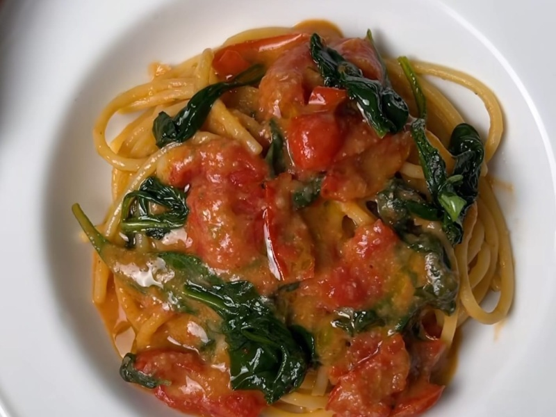

---
tags:
  - italian
  - pasta
---

# Pasta with Beans and Cherry Tomatoes

| :material-clock-outline: Time | :fork_and_knife: Servings |
|-------------------------------|---------------------------|
| 30 min                        | 2 portions                |

---

## Ingredients

- _1 can of white beans of your choice (e.g. cannellini)_
- _40g_ basil
- 50ml tomato sauce
- 1 clove of garlic
- 100g cherry tomatoes
- 50g spinach (optional)
- EVO oil
- salt and pepper

---

## Instruction

1. Cut the cherry tomatoes in half and sauté them in a pan with a bit of EVO oil, salt and a clove of garlic.
2. Mix the white beans with the basil, tomato sauce, salt, and pepper in a blender until you achieve a creamy consistency.
3. Add the blended mixture to the pan with the cherry tomatoes and the cooked pasta. If you like, you can also add some spinach. Mix everything well and serve.

---

## Inspiration
[Instagram](https://www.instagram.com/reel/C91xQdnN3Dg/?igsh=MWdoemFpdzY5bmk5bQ%3D%3D)
