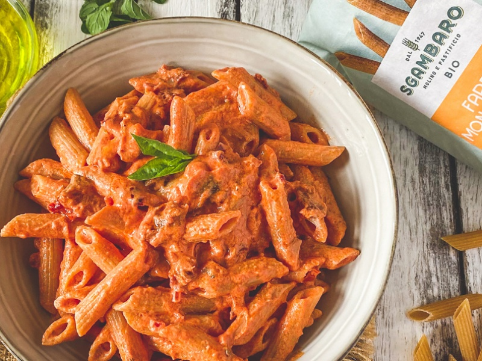

---
tags:
  - italian
  - pasta
---

# Pasta with Dry Tomatoes Sauce

| :material-clock-outline: Time | :fork_and_knife: Servings |
|-------------------------------|---------------------------|
| 10 min                        | 2 portions                |

---

## Ingredients

- _60g_ dry tomatoes
- _30g_ cashews
- 2 tsp capers
- peel of 1/2 orange (or orange zest already grated)
- EVO oil, salt and pepper

---

## Instruction

1. Note: Unless the dry tomatoes are in a jar with oil, soak them in warm water for about 10 minutes.
2. Soak the cashews in warm water for about 10 minutes.
3. Blend the dry tomatoes, cashews, capers, orange peel, a drizzle of EVO oil, salt, pepper and a spoon of pasta water.
4. Mix the pasta with the sauce in a pan. If the sauce is too thick, add a bit more pasta water.
6. Serve with a drizzle of EVO oil, pepper and some grated vegan cheese.

---

## Inspiration
[Instagram - Di Pazza](https://www.instagram.com/reel/DKAF9kKiidv/?igsh=MTRmN2NuOXFvMmFpcQ%3D%3D)
