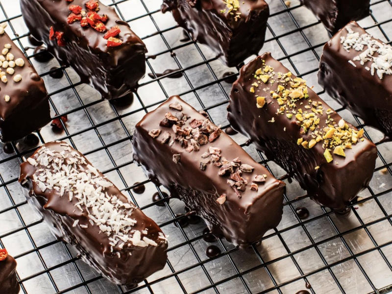

---
tags:
  - snack
---

# Protein Bars

| :material-clock-outline: Time | :fork_and_knife: Servings |
|-------------------------------|---------------------------|
| 60 min                        | 16 bars                   |

---

## Ingredients

- 400g peanut butter crunchy
- 210g protein powder plant based (unflavoured)
- 100g almonds (ground)
- 170g chia seeds milled
- 4 tbsp maple syrup
- 290ml water
- 160g medjool date roughly chopped
- 250g dark chocolate (80%) roughly chopped

---

## Instruction

1. Line a 20x28cm baking tray with parchment paper.
2. Put a small amount of water into a kettle and bring to the boil. Place the dates into a shallow bowl and pour over a small amount of boiling water - just enough to cover. Set aside to soak for about 10 minutes, then roughly mash with a potato masher or the back of a fork until you have a spreadable paste.
3. Place the peanut butter, protein powder, ground almonds, milled chia seeds, maple syrup, and water into a food processor and blend until smooth. Scrape into the prepared tin and press down using the back of a spoon.
4. Spread out the mashed dates on top as evenly as possible.
5. Place into the fridge to chill for 30 minutes, until firm.
6. Slowly melt the chocolate with a low heat (200W for 2 min).
7. Pour the chocolate over mashed dates and the top layer.
8. Before the chocolate becomes firm, sprinkle over some extra toppings and slice the content into 18 even-sized bars.

---

## Inspiration

* [Dr. Rupy's No Bake Protein Bar](https://www.thedoctorskitchen.com/recipes/dr-rupy-s-no-bake-protein-bar)
