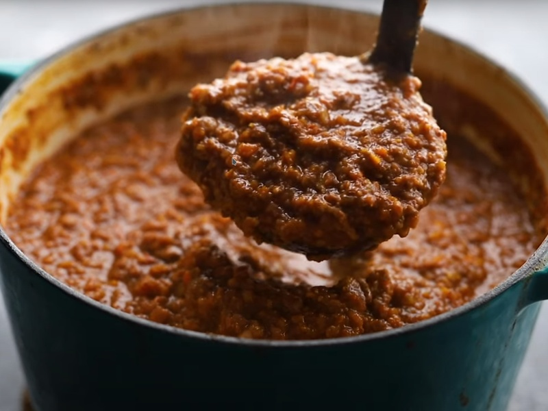

---
tags:
  - italian
  - pasta
---

# Ragù (Bolognese Sauce)

| :material-clock-outline: Time | :fork_and_knife: Servings |
|-------------------------------|---------------------------|
| 2 hours                       | 8 portions                |

## Ingredients

- 2 onions
- 4 garlic gloves
- _400g_ mushrooms
- 3 carrots
- 3 celery sticks
- a splash of red wine
- _200g_ walnuts
- _240g_ red lentils (or _400g_ of vegan minced meat)
- _500g_ tomato sauce
- _500ml_ vegetable broth
- 4 bay leaves
- salt and pepper

---

## Instruction

1. Use food processor to chop onions, garlic and mushrooms.
2. Move the blended mixture into a large pot and sauté it until it gets brown.
3. Blend carrots and celery and add them to the pot.
4. Add red wine and let it evaporate.
5. Blend walnuts and add them to the pot.
6. Let the mixture cook for a few minutes until it's nice and brown.
7. Add lentils, tomato sauce, vegetable broth and bay leaves.
8. Decrease the heat and let it cook for at least 30 minutes.
9. Add salt and pepper to taste.
10. Stir often and add water as needed.
