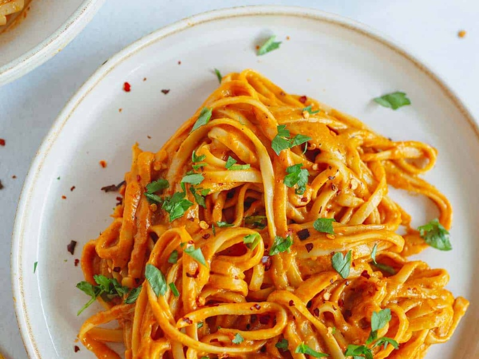

---
tags:
  - italian
  - pasta
---

# Roasted Red Pepper Sauce

| :material-clock-outline: Time | :fork_and_knife: Servings |
|-------------------------------|---------------------------|
| 20 min                        | 4 portions                |

---

## Ingredients

- _2_ red bell peppers
- _1/4_ cup of fresh basil
- _1/2_ cup water
- _1_ tsp salt and pepper
- _1_ tbsp olive oil
- _1_ tsp of oregano
- _1_ tbsp lemon juice
- _3_ tbsp nutritional yeast
- _75g_ of cashews or pine nuts
- _1_ clove of garlic
- chili powder (optional)

---

## Instruction

1. Slice the red peppers in big chunks and roast them in the oven at 200°C for about 20 minutes. Alternatively, you can roast them in a pan or in the air fryer.
2. Once the peppers are roasted, let them cool down for a few minutes.
3. Add them to a blender with all of the remaining ingredients and blend until smooth. Taste and add any additional salt or spices, if desired.
4. Garnish with fresh chopped basil and pine nuts.

---

## Inspiration
[The Vegan 8](https://thevegan8.com/creamy-red-pepper-sauce-with-fresh-basil/)
