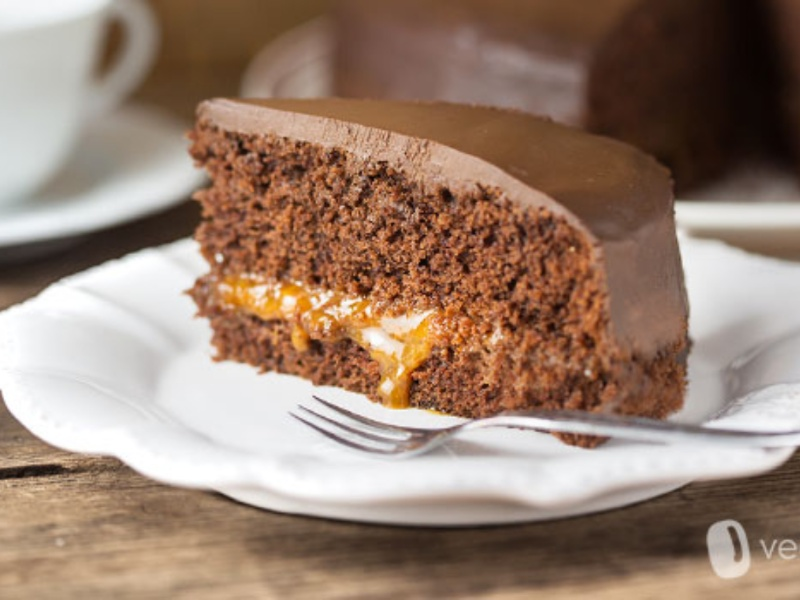

---
tags:
  - desert
---

# Sacher Torte

| :material-clock-outline: Prep Time | :material-clock-outline: Cook Time | :fork_and_knife: Servings |
|------------------------------------|------------------------------------|---------------------------|
| 1 h 20 min                         | 40 min                             | 1 cake (24 cm ∅)          |

---

## Ingredients

### Base:

- _240g_ flour
- _150g_ cane sugar
- _25g_ cocoa
- _16g_ of baking powder
- _90g_ of seed oil
- _230g_ soy milk
- vanilla flavour
- a pinch of salt

### Glaze

- _180g_ of apricot jam
- _200g_ castor sugar
- _150g_ dark (couverture) chocolate

---

## Instructions

### Base

1. Preheat the oven to 180˚C.
2. Combine flour, cocoa powder, baking powder and salt.
3. In another container mix sugar, milk, oil and vanilla flavor.
4. Combine your dry and wet parts and stir or whisk into a smooth batter.
5. Bake the cake for around 40 minutes.
6. Take the cake out of the tins and onto a cooling rack. Let cool down for about an hour.

### Filling

1. Heat the jam up a bit (on the hob or in the microwave) to make it more liquid and spreadable. This will also help it adhere to the cake and make it richly moist.
2. Cut the cake in half and spread a good layer of jam on the layer of the cake that will be at the bottom.
3. Place the second layer of cake on top and use the rest of the jam to cover the whole top and the sides of the cake.
4. Let the jam cool down and set for a bit (around 15 min).

### Glazing

1. To make the glaze, put the castor sugar into a saucepan with 125 ml water and boil over high heat for approximately 5 minutes.
2. Take the sugar syrup off the stove and leave to cool a little.
3. Coarsely chop the chocolate, gradually adding it to the syrup, and stir until it forms a thick liquid.
4. Pour all the lukewarm glaze liquid at once over the top of the cake and quickly spread using a palette knife. Leave the glaze to set for a few hours. Serve garnished with whipped cream.
