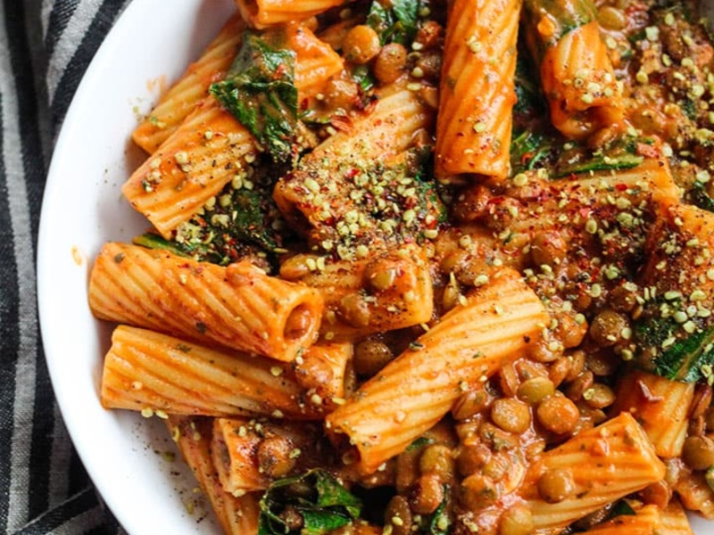

---
tags:
  - pasta
---

# Smoky Lentils Sauce

| :material-clock-outline: Time | :fork_and_knife: Servings |
|-------------------------------|---------------------------|
| 30 min                        | 4 portions                |

---

## Ingredients

- _250g_ red lentils
- _60g_ tomato paste or _100g_ of tomato sauce
- 1 clove of garlic
- 1 tbsp tahini or 2 tbsp hummus
- 2 tsp smoked paprika
- 1 tsp origano
- 2 tsp soy sauce
- 1 tsp agave syrup (or similar)
- veggie broth
- salt and pepper
- 2 cups loosely packed spinach or greens (optional)

---

## Instruction

1. Add the lentils to a sauce pan with oil and one clove of garlic and sauté them for a few minutes.
2. Add veggie broth. Bring to a boil, then reduce to a low simmer and cook for 10 minutes on low heat, covering with a lid.
3. Add tomato paste and all seasonings listed in the ingredients.
4. Cook everything until the lentils are soft (about 10 more minutes).
5. Once the lentils are coked add the tahini or hummus and mix well. If you like, you can also add some spinach or greens at this point.
6. Once pasta is cooked, reserve 1/2 cup of pasta water and drain the pasta.
7. Add pasta and pasta water to the pan with the lentils.
8. Stir and serve!
---

## Inspiration
