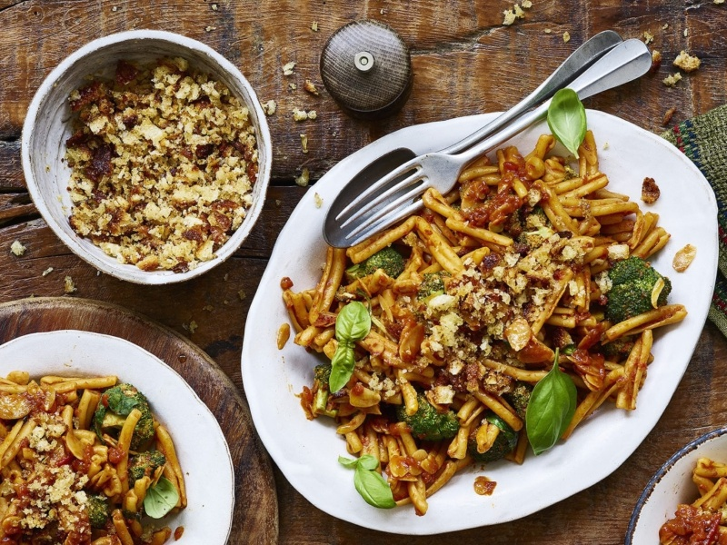

---
tags:
  - pasta
  - italian
  - brocolli
---

# Sundried Tomato and Brocolli Pasta

| :material-clock-outline: Time | :fork_and_knife: Servings |
|-------------------------------|---------------------------|
| 30 min                        | 2 portions                |

--- 

## Ingredients

### Mains
- _250 g_ of pasta of your choice
- 1 head of broccoli, cut into small florets
- handful of fresh basil
- 3 tbsp flaked almonds
- 2 tbsp olive oil

### Sauce
- 10 sundried tomatoes
- 2 tbsp nutritional yeast
- 2 tbsp tomato purée
- 1 garlic clove or 1 tsp garlic powder
- juice of ½ lemon.
- pinch sea salt
- 1 tsp dried chilli flakes (optional)

### Pangrattato
- 2 tbs olive oil
- 1 cup breadcrumbs
- 1 tsp oregano
- Pinch of Salt

--- 

## Instruction

1. Add all the sauce ingredients to a blender and blend until smooth. Add a splash of water if necessary to help it blend. Set aside.
2. Take a large sauce pan. Add the olive oil, almonds and broccoli. Cook for 2-3 minutes until the almonds are golden brown. 
3. Add a splash of water and cover the pan. This will help steam the broccoli.
4. Add the sauce to the pan and stir to combine.
5. Add the pasta to a large pan of boiling water and cook according to the packet instructions. 
6. Drain the pasta and add it to the pan with the sauce. Stir to combine.
7. On a separate pan, add the Pangrattato ingredients. Cook for 2-3 minutes until the breadcrumbs are golden brown. Be careful not to burn them.
8. Serve the pasta with the Pangrattato and fresh basil.

---

## Inspiration
- [Gaz Oakley (Avant Garde)](https://www.gazoakleychef.com/recipes/sun-dried-tomato-broccoli-pasta-pangrattoto/)
