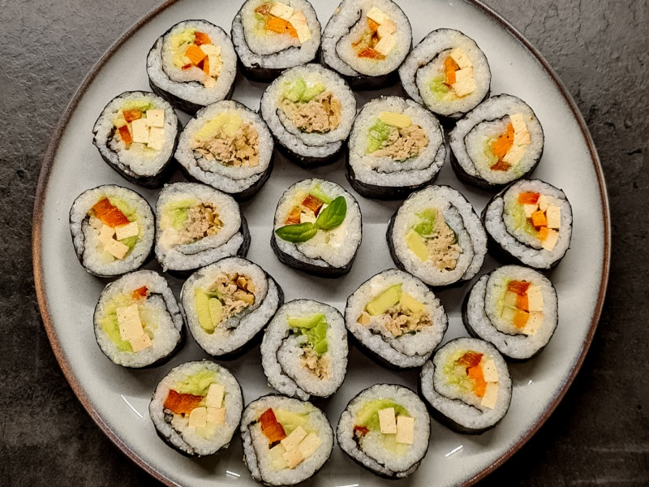

---
tags:
  - asian
  - rice
  - tuna
---

# Sushi

| :material-clock-outline: Cook Time | :material-clock-outline: Prep Time | :fork_and_knife: Servings |
|------------------------------------|------------------------------------|---------------------------|
| 15 min                             | 30 min                             | 5 rolls                   |

---

## Ingredients

### Base

- _400g_ sushi rice
- _600ml_ water
- 1/4 cup rice vinegar
- 2 tbsp sugar
- 1 tsp salt
- 5 x nori sheets

### Filling

1. Option
    - Vegan Tuna
    - Mayo
    - Avocado
    - Walnuts
    - Sesame seeds
    - Siracha
2. Option
    - Tofu
    - Mayo
    - Cucumber
    - Red Bell Pepper
    - Siracha
---

## Instructions

1. Rinse the rice until the water runs clear.
2. Boil the rice in the water for 15 min.
3. Remove from heat and let it sit for 15 min with lid on.
4. Mix the vinegar, sugar and salt in a small bowl and microwave for 30 sec. Stir until the sugar and salt are dissolved.
5. Add the vinegar mixture to rice. Mix well and let it cool down.
6. Place a nori sheet on a bamboo mat.
7. Spread the rice on the nori sheet.
8. Add the filling according to your desire.
9. Roll the sushi.
10. Cut the sushi roll into pieces.
11. Serve with soy sauce and wasabi.
