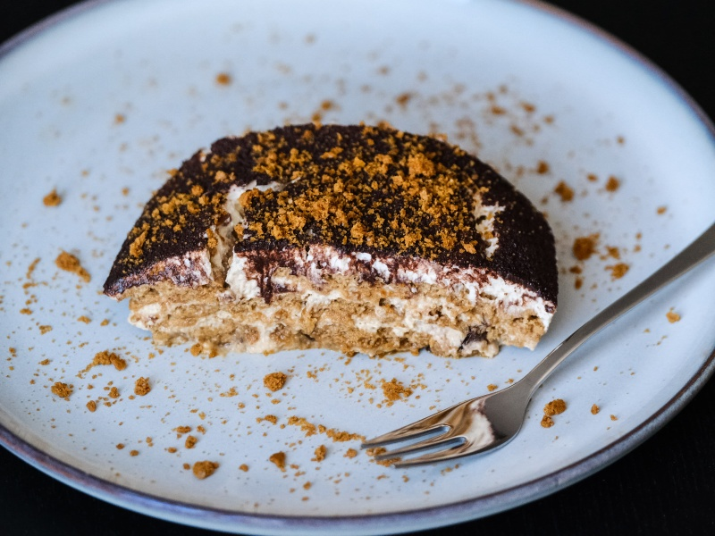

---
tags:
  - italian
  - dessert

---

# Tiramisu

| :material-clock-outline: Time | :fork_and_knife: Servings |
|-------------------------------|---------------------------|
| 20 min                        | 8 portions                |

---

## Ingredients

- _500g_ speculoos cookies
- _600g_/_700g_ silken tofu
- _200ml_ plant-based whipped cream
- agave syrup and powdered sugar to taste
- _1 tbsp_ vanilla or caramel extract
- 1 or 2 espresso cups
- cocoa powder
- chocolate chips (optional)

---

## Instruction

1. Prepare the espresso and let it cool down. If you do only one cup you can dilute it with some water or milk. Add some sugar if you like.
2. Blend the silken tofu with agave syrup, powdered sugar and vanilla extract until smooth and until it reaches the right level of sweetness.
3. Separately whip the plant-based whipped cream until it becomes firm.
4. With a spatula gently combine the plant-based whipped cream into the blended tofu.
5. Start assembling the tiramisu by dipping the speculoos cookies in the espresso and placing them in a layer at the bottom of a dish.
6. Spread a layer of creamy mixture on top of the cookies. If you like, you can add some chocolate chips before the next layer.
7. Repeat the process until you reach the top of the dish, finishing with a layer of the creamy mixture.
8. Dust the top layer with cocoa powder.
9. Let it rest in the fridge for at least 2 hours, preferably overnight, to allow the flavors to meld and the texture to set.

---

## Inspiration
