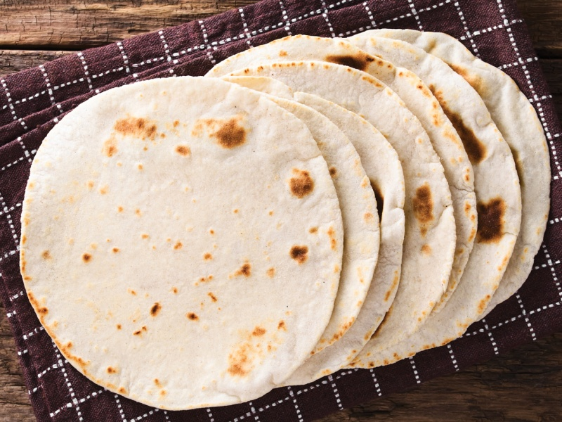

---
tags:
  - bread
---

# Tortilla

| :material-clock-outline: Time | :fork_and_knife: Servings |
|-------------------------------|---------------------------|
| 30 min                        | 8 tortillas               |

---

## Ingredients

- _300g_ flour
- _150g_ very hot water
- _15g_ oil
- 1 tsp salt

---

## Instruction

1. Mix all ingredients first with a spoon, then knead by hand until you obtain a smooth ball.
2. Divide the dough into 8 equal balls. Any balls you don't need can go directly in the freezer without wrapping — they keep very well. Thaw at room temperature for about an hour before using.
3. Roll out each ball with flour and a rolling pin, as thin as possible.
4. Cook in a very hot pan, 1-2 minutes per side. They must remain light in color so they don't dry out.
5. Let them cool on a wooden board, covered with a cloth to keep them soft.
6. Stuff and close them — pan-fry to seal if making burritos.

---

## Inspiration

- [Instagram](https://www.instagram.com/)
